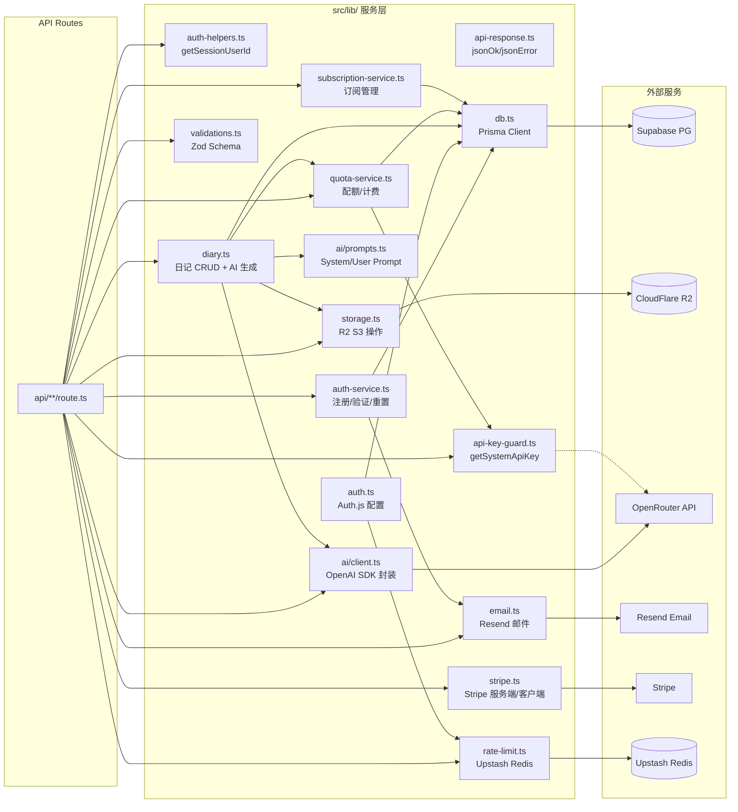
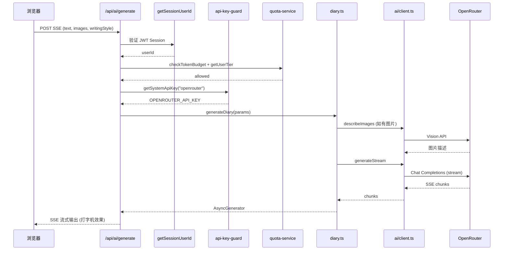
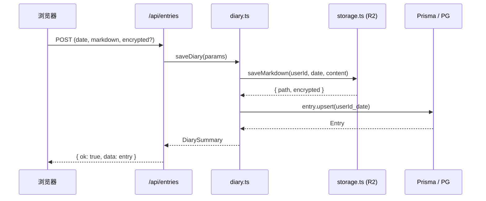
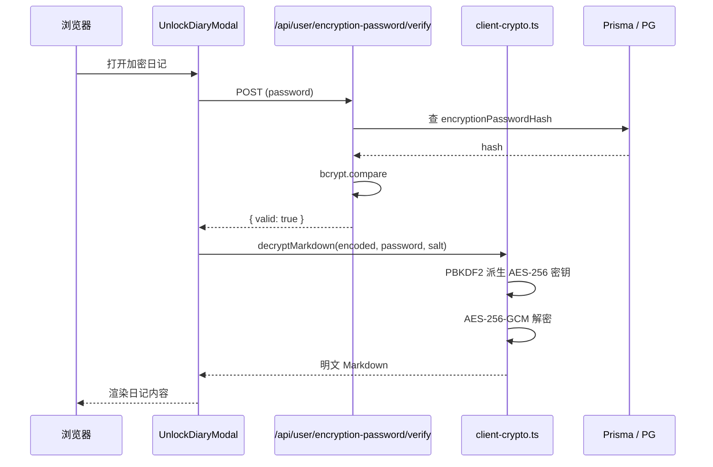

# 代码架构速查 — 玲音日记

> AI Agent 维护用。读完此文档即可定位到要改的文件。
> 生成日期：2025-07-17 · 基于 `src/` `prisma/` `config/` 实际代码

---

## 1. 路由 ↔ 文件映射

### 1.1 页面路由

| 路由 | 源文件 | 职责 |
|---|---|---|
| `/` | `src/app/page.tsx` | 首页（DashboardStats + 快速入口） |
| `/login` | `src/app/login/page.tsx` | 登录 |
| `/register` | `src/app/register/page.tsx` | 注册 |
| `/verify-email` | `src/app/verify-email/page.tsx` | 邮箱验证（读 query token） |
| `/forgot-password` | `src/app/forgot-password/page.tsx` | 忘记密码 |
| `/reset-password` | `src/app/reset-password/page.tsx` | 重置密码（读 query token） |
| `/diary` | `src/app/diary/page.tsx` | 日记编辑器（新建） |
| `/diary/[id]` | `src/app/diary/[id]/page.tsx` | 日记详情 + 编辑 |
| `/timeline` | `src/app/timeline/page.tsx` | 时间线列表 + 日历视图 |
| `/settings` | `src/app/settings/page.tsx` | 设置页 |
| `/subscription` | `src/app/subscription/page.tsx` | 订阅管理 |
| `/setup` | `src/app/setup/page.tsx` | 首次设置引导 |
| `/admin` | `src/app/admin/page.tsx` | 管理后台（ADMIN_EMAIL 校验） |
| `/forgot-encryption-password` | `src/app/forgot-encryption-password/page.tsx` | E2EE 密码丢失说明 |

导航配置：`config/navigation.json`（nav bar + mobile bottom bar 的菜单项）。

### 1.2 API 路由

| 方法 | 路由 | 源文件 | 依赖的 lib | 职责 |
|---|---|---|---|---|
| GET/POST | `/api/auth/[...nextauth]` | `src/lib/auth.ts` (exports) | `auth.ts`, `db.ts`, `rate-limit.ts` | Auth.js JWT 签发/续期 |
| POST | `/api/auth/register` | `api/auth/register/route.ts` | `auth-service.ts`, `validations.ts`, `rate-limit.ts` | 注册 + 发验证邮件 |
| GET | `/api/auth/verify-email` | `api/auth/verify-email/route.ts` | `auth-service.ts`, `rate-limit.ts` | 邮箱验证 |
| POST | `/api/auth/resend-verification` | `api/auth/resend-verification/route.ts` | `auth-service.ts`, `validations.ts`, `rate-limit.ts` | 重发验证邮件 |
| POST | `/api/auth/forgot-password` | `api/auth/forgot-password/route.ts` | `auth-service.ts`, `validations.ts`, `rate-limit.ts` | 发送密码重置邮件 |
| POST | `/api/auth/reset-password` | `api/auth/reset-password/route.ts` | `auth-service.ts`, `validations.ts`, `rate-limit.ts` | 重置密码 |
| GET/POST | `/api/entries` | `api/entries/route.ts` | `diary.ts`, `validations.ts`, `rate-limit.ts` | 列表/日历查询 + 保存 |
| GET/PUT/DELETE | `/api/entries/[id]` | `api/entries/[id]/route.ts` | `diary.ts`, `validations.ts` | 单篇查询/更新/删除 |
| POST (SSE) | `/api/ai/generate` | `api/ai/generate/route.ts` | `diary.ts`, `ai/client.ts`, `api-key-guard.ts`, `quota-service.ts` | AI 生成日记 |
| POST (SSE) | `/api/ai/rewrite` | `api/ai/rewrite/route.ts` | `ai/client.ts`, `ai/prompts.ts`, `api-key-guard.ts`, `quota-service.ts` | AI 润色 |
| POST | `/api/ai/test` | `api/ai/test/route.ts` | `ai/client.ts`, `api-key-guard.ts`, `quota-service.ts` | 测试 LLM 连接 |
| POST | `/api/upload` | `api/upload/route.ts` | `storage.ts`, `rate-limit.ts` | 图片上传（R2） |
| GET | `/api/image` | `api/image/route.ts` | `storage.ts`, `rate-limit.ts` | 图片签名 URL（按 owner 鉴权） |
| POST/PUT | `/api/user/encryption-password` | `api/user/encryption-password/route.ts` | `db.ts` (Prisma), `validations.ts` | 设置/修改 E2EE 密码 |
| POST | `/api/user/encryption-password/verify` | `api/user/encryption-password/verify/route.ts` | `db.ts` | 验证 E2EE 密码 |
| GET | `/api/user/encryption-password/status` | `api/user/encryption-password/status/route.ts` | `db.ts` | 查询 E2EE 状态 + salt |
| GET/PUT | `/api/user/config` | `api/user/config/route.ts` | `db.ts`, `personas.ts`, `validations.ts` | 用户写作风格配置 |
| GET/PUT | `/api/user/style` | `api/user/style/route.ts` | `db.ts`, `personas.ts`, `validations.ts` | 写作风格 + 首次设置标记 |
| POST | `/api/subscription/checkout` | `api/subscription/checkout/route.ts` | `stripe.ts` | Stripe 订阅结账 |
| POST | `/api/subscription/webhook` | `api/subscription/webhook/route.ts` | `stripe.ts`, `subscription-service.ts`, `quota-service.ts` | Stripe Webhook |
| GET | `/api/subscription/status` | `api/subscription/status/route.ts` | `subscription-service.ts`, `stripe.ts` | 订阅状态 |
| GET | `/api/subscription/portal` | `api/subscription/portal/route.ts` | `stripe.ts` | Stripe Customer Portal |
| POST | `/api/topup/checkout` | `api/topup/checkout/route.ts` | `stripe.ts` | Token 加购结账 |
| GET | `/api/topup/bundles` | `api/topup/bundles/route.ts` | `quota-service.ts` | 加购套餐列表 |
| GET | `/api/quota/status` | `api/quota/status/route.ts` | `quota-service.ts` | Token + 存储配额 |
| GET | `/api/pricing` | `api/pricing/route.ts` | `subscription-service.ts`, `stripe.ts` | 定价方案列表 |
| GET | `/api/invoices` | `api/invoices/route.ts` | `db.ts` | 发票列表 |
| GET | `/api/stats` | `api/stats/route.ts` | `stats.ts`, `rate-limit.ts` | 用户仪表盘统计 |
| GET | `/api/admin/stats` | `api/admin/stats/route.ts` | `db.ts` | 管理后台统计 |
| GET | `/api/export` | `api/export/route.ts` | `db.ts`, `storage.ts` | 导出全量日记 JSON |
| GET | `/api/health` | `api/health/route.ts` | `db.ts` | 健康检查 |
| GET/POST | `/api/diary/migrate-encrypt` | `api/diary/migrate-encrypt/route.ts` | `db.ts`, `storage.ts` | 明文→加密迁移 |
| GET | `/api/diary/migrate-status` | `api/diary/migrate-status/route.ts` | `db.ts` | 迁移进度 |

---

## 2. lib 层依赖图



---

## 3. 核心数据流

### 3.1 AI 生成日记



### 3.2 保存日记



### 3.3 E2EE 日记解锁



---

## 4. 数据库模型速查

```mermaid
erDiagram
  User ||--o{ Entry : has
  User ||--o{ VerificationToken : has
  User ||--o{ PasswordResetToken : has
  User ||--o{ TokenUsage : has
  User ||--o{ TokenTopUp : has
  User ||--|| Subscription : has

  User {
    id cuid PK
    email unique
    passwordHash bcrypt12
    subscription free-basic-advanced
    encryptionPasswordHash bcrypt
    encryptionSalt plaintext
    writingStyle JSON
    topUpBalanceUsd float
    tokenRolloverUsd float
    hasCompletedSetup bool
  }

  Entry {
    id cuid PK
    userId FK
    date FK
    markdownPath R2路径
    preview 前200字-加密则null
    wordCount int
    hasImages bool
    tags JSON
  }

  Subscription {
    userId unique FK
    plan free-basic-advanced
    status active-past_due-canceled
    stripeId
    stripePriceId
  }
```

**@unique 约束**: `Entry(userId, date)` — 每人每天一篇。

---

## 5. 添加新功能 checklist

| 场景 | 步骤 |
|---|---|
| **新页面** | 1. `src/app/{name}/page.tsx` 2. 如需导航栏入口 → `config/navigation.json` 加一项 |
| **新 API** | 1. `src/app/api/{name}/route.ts` 2. 业务逻辑 → `src/lib/{service}.ts` 3. Zod Schema → `src/lib/validations.ts` |
| **新 DB 模型/字段** | 1. 改 `prisma/schema.prisma` 2. `npx prisma migrate dev --name {desc}` 3. 更新 `src/types/index.ts` |
| **新 LLM provider** | 1. `src/lib/ai/client.ts` 加 PROVIDER_CONFIGS 2. `src/lib/api-key-guard.ts` 加 env var 映射 3. `src/lib/validations.ts` 加 VALID_PROVIDERS |
| **新计费方案** | 1. `config/billing-pricing.json` 加 tiers/models 2. Stripe Dashboard 创建 Price 3. Vercel 加 `STRIPE_PRICE_*` env var |
| **新组件** | `src/components/{Name}.tsx` — 页面直接 import |
| **全局状态** | `src/contexts/{Name}Context.tsx` → `src/app/layout.tsx` 注册 Provider |

---

## 6. 关键约定

- **鉴权**: 所有 API 路由开头 `const user = await getSessionUserId()` → `if (!user) return jsonError("Unauthorized", 401)`
- **限流**: 每个 API 路由 `checkRateLimit(rateLimiters.xxx, key)` + `rateLimitError(reset)`
- **响应格式**: `{ ok: true, data }` / `{ ok: false, error: "..." }` 来自 `api-response.ts`
- **输入校验**: Zod Schema 在 `validations.ts`，路由层 `safeParse` → `formatZodError`
- **存储路径**: R2 路径 `users/{userId}/entries/{YYYY}/{MM}/{YYYY-MM-DD}.md`（加密 `.enc.md`）
- **E2EE**: 密钥派生和加解密全部在浏览器 `client-crypto.ts`（`"use client"`），服务端只存 bcrypt hash + plaintext salt
